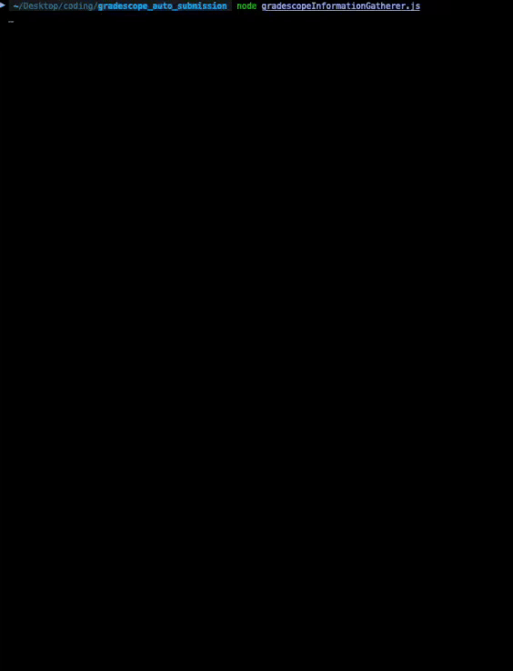

## GradeScope Bot



Prerequisite Node js 

Mac os: 

```
# Download and install nvm:
curl -o- https://raw.githubusercontent.com/nvm-sh/nvm/v0.40.3/install.sh | bash

# in lieu of restarting the shell
\. "$HOME/.nvm/nvm.sh"

# Download and install Node.js:
nvm install 24

# Verify the Node.js version:
node -v # Should print "v24.11.1".

# Verify npm version:
npm -v # Should print "11.6.2".
```

Windows: 

```
# Download and install Chocolatey:
powershell -c "irm https://community.chocolatey.org/install.ps1|iex"
# Download and install Node.js:
choco install nodejs --version="24.11.1"
# Verify the Node.js version:
node -v # Should print "v24.11.1".
# Verify npm version:
npm -v # Should print "11.6.2". 
```


# Step 1, Clone the Project

This can be done either through downloading the file's zip (Green "code" Button ) or cloning the project with git commands.

`git clone -b master https://github.com/codingpizza420/gradescopeBot.git`


# Step 2, Setting up project enviornment

Once the folder is installed, enter the folders directory

Mac os example of location: `/Users/Diego/gradescopeBot`

Windowss os example of location `C:\Users\Diego\gradescopeBot`

write the following commands:

1. `npm install` ( Makes sure all project dependencies are installed)
1. `npm link` ( Link the CLI globally )

# Step 3, run the project

This project is now installed and can be ran with the following command anywhere on your system.

run `gradescopeBot`


